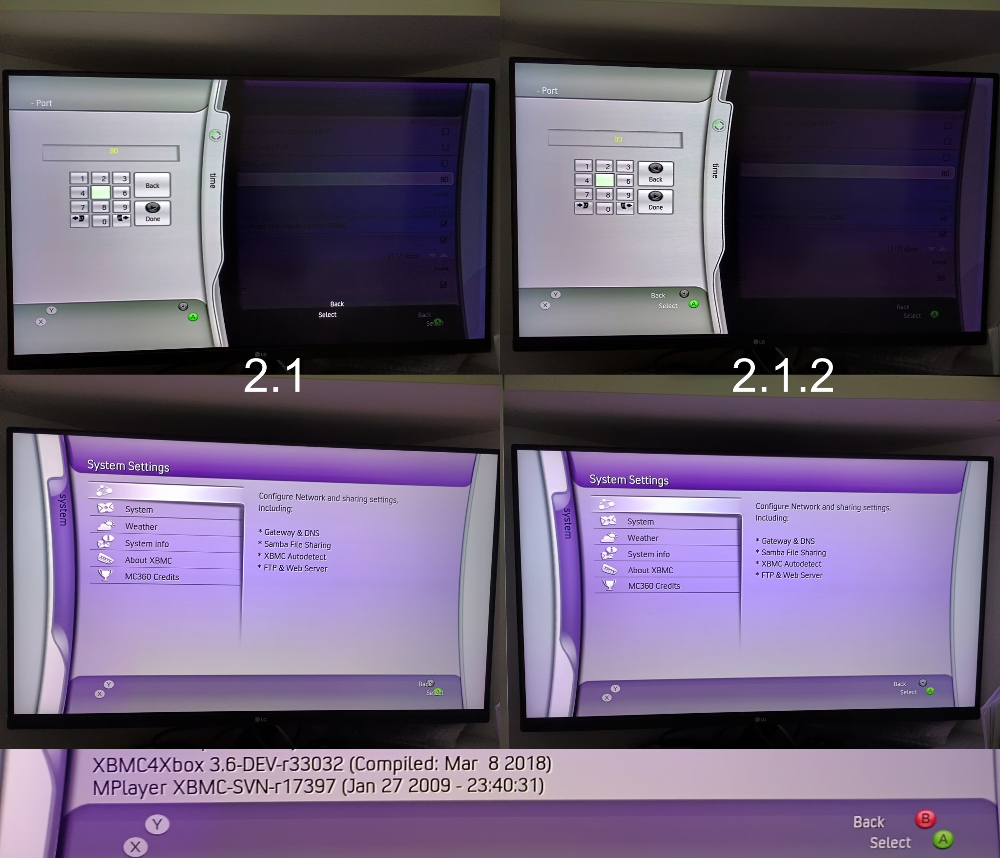

# MC360
Pulled from http://svn.code.sf.net/p/xboxmediacenter/code/MC360/

Fixed various bugs, alignments and functions not working correctly.
tested on XBMC4Xbox 3.6-DEV-33032 and XBMC4Xbox 3.6-DEV-33046

Note: Each time you change the aspect ratio (4/3, 16/9) you must restart your console for it to be applied correctly.
